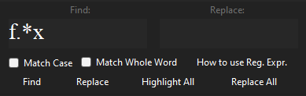

# About Notepad

Notepad is a simple text editor built using C# and the .NET Framework. It provides basic text editing functionality with features like saving, opening and creating new files.

## Installation

Download the source code from [releases](https://github.com/cristinel24/notepad/releases) page then run `Notepad.exe` from `./notepad/`.

## Shortcuts

### File managemenet

`Ctrl + N` - New file\
`Ctrl + Shift + N` - New Notepad Instance\
`Ctrl + O` - Open a file from your computer\
`Ctrl + S` - Save the file in your computer\
`Ctrl + Shift + S` - Save the file as\
`Ctrl + P` - Print file\
`Ctrl + Shift + P` - Print Preview\n

### Text Control

`Ctrl + Z` - Undo last change in file (from current session)\
`Ctrl + Y` - Redo last change in file (from current session)\
`Ctrl + X` - Cut all selected text\
`Ctrl + C` - Copy all selected text\
`Ctrl + V` - Paste the copied text\
`Ctrl + A` - Select all text\
`Ctrl + F` - Find a string from text file (Regular Expressions are Enabled)\
`Ctrl + H` - Replace a string from text file (Regular Expressions are Enabled)\
`Delete` - Delete a character after the cursor line\
`Ctrl + Delete` - Delete a word after the cursor line\
`Backspace` - Delete a character behind the cursor line\
`Ctrl + Backspace` - Delete a word behind the cursor line\

#### How to use Regular Expressions

You can use Regular Expressions(Regex) to find faster certain items in a text file. Documentation can be found [here](https://learn.microsoft.com/en-us/dotnet/standard/base-types/regular-expression-language-quick-reference). [Practice your Regex skills!](https://regexr.com/).

### Text Behaviour

`Ctrl + L` - Left indent current/selected text\
`Ctrl + R` - Right indent current/selected text\
`Ctrl + E` - Center indent current/selected text\
`Ctrl + J` - Justify indent current/selected text\
`Alt + W` - Toggles word wrap function\
`F5` - Write current date in long format\
`Ctrl + MouseScroll` - Zoom in/out

### Text Format

`Alt + F` - Change current text font\
`Alt + A` - Highlight current selected text\
`Ctrl + B` - Makes the currently selected text bold\
`Ctrl + I` - Makes the currently selected text italic\
`Ctrl + U` - Makes the currently selected text underlined\
`Ctrl + Q` - Strikeout Text

### Customization

`Alt + B` - Change background color of text box\
`Alt + T` - Change text color of the entire file\
`Alt + H` - Change the highlight color\
`Alt + C` - Change text color of the current selected text\
`Alt + O` - Change Opacity of Application

### Other

`F1` - Open this page

